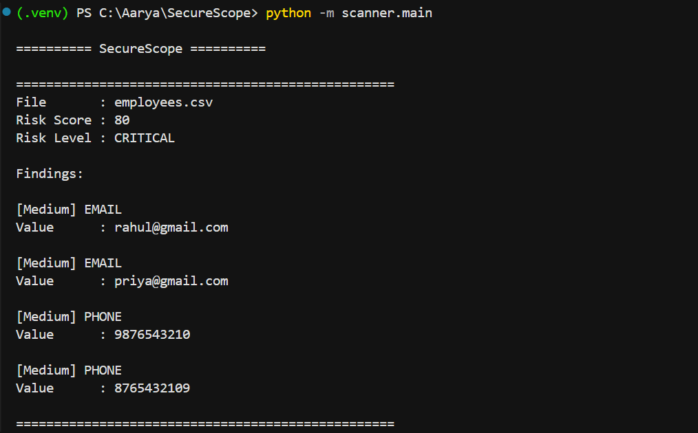
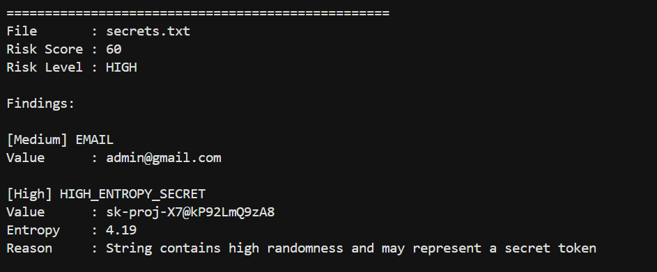
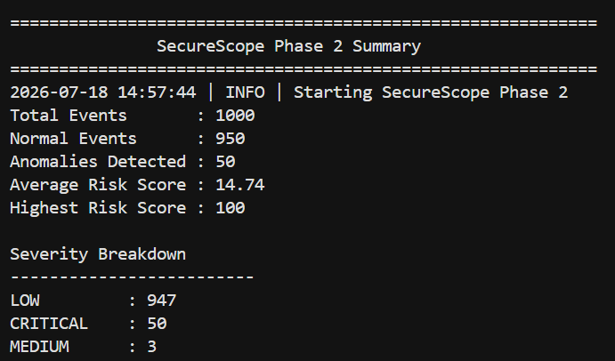
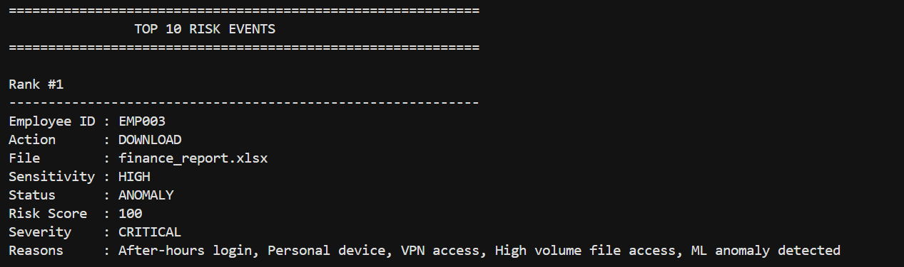
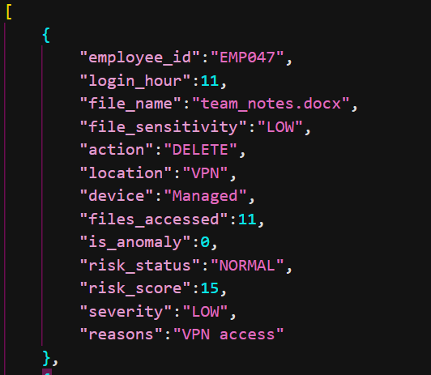

# 🔐 SecureScope

## AI-Powered DSPM & Insider Risk Detection Platform

SecureScope is an AI-powered security analysis platform designed to discover sensitive data exposure, detect potential security risks, and identify suspicious insider activity using machine learning and risk-based analysis.

The platform combines **Data Security Posture Management (DSPM)** concepts with **ML-based anomaly detection** to help organizations understand where sensitive information exists and identify unusual user behavior.

---

# 🚀 Features

## Phase 1 — Data Discovery & Classification

SecureScope scans files and identifies sensitive information exposure.

### Capabilities:

✅ File discovery and scanning  
✅ Sensitive data detection  
✅ Email detection  
✅ Phone number detection  
✅ Password exposure detection  
✅ High entropy secret detection  
✅ Risk scoring engine  
✅ Automated JSON reports  


Example detections:

```
EMAIL
PHONE
PASSWORD_EXPOSURE
HIGH_ENTROPY_SECRET
```

---

# Phase 2 — AI Insider Risk Detection

SecureScope analyzes user activity logs and detects abnormal behavior using machine learning.

### Capabilities:

✅ Synthetic security event generation  
✅ Feature engineering  
✅ Isolation Forest anomaly detection  
✅ Behavioral risk scoring  
✅ Executive security summary  
✅ Top risk event ranking  
✅ CSV report export  
✅ JSON report export  
✅ Logging system  
✅ ML model persistence  


Detected risk factors:

```
After-hours activity
VPN access
Personal device usage
Large file downloads
Critical file access
Abnormal behavior patterns
```

---

# 🏗️ Architecture


## Phase 1 Architecture


```
Files
 |
 v
File Scanner
 |
 v
Sensitive Data Detector
 |
 v
Secret Detector
 |
 v
Risk Engine
 |
 v
JSON Security Report
```


## Phase 2 Architecture


```
Security Logs
 |
 v
Feature Engineering
 |
 v
Isolation Forest Model
 |
 v
Anomaly Detection
 |
 v
Risk Engine
 |
 v
Summary + Ranking
 |
 v
CSV / JSON Reports
```

---

# 🛠️ Tech Stack


## Programming Language

- Python


## Machine Learning

- Scikit-learn
- Isolation Forest
- Pandas
- NumPy


## Data Processing

- Pandas
- Regex
- Entropy Analysis


## Reporting

- JSON
- CSV


## Development

- Git
- GitHub
- Virtual Environment


---

# 📂 Project Structure


```
SecureScope/

│
├── anomaly/
│   │
│   ├── main.py
│   ├── pipeline.py
│   ├── features.py
│   ├── detector.py
│   ├── risk.py
│   ├── summary.py
│   ├── ranking.py
│   ├── exporter.py
│   ├── logger.py
│   └── model_manager.py
│
│
├── sample_data/
│
├── reports/
│
├── logs/
│
├── models/
│
├── requirements.txt
│
└── README.md

```

---

# ⚙️ Installation


Clone the repository:

```bash
git clone https://github.com/aaryabrahme/SecureScope.git
```

Navigate into the project:

```bash
cd SecureScope
```

Create virtual environment:

```bash
python -m venv .venv
```

Activate environment:


Windows:

```bash
.venv\Scripts\activate
```


Install dependencies:

```bash
pip install -r requirements.txt
```

---

# ▶️ Usage


Run SecureScope:

```bash
python -m anomaly.main
```


The system will:

1. Load security logs
2. Generate features
3. Detect anomalies
4. Calculate risk scores
5. Generate reports


---

# 📊 Sample Output


Example security summary:

```
========== SecureScope Summary ==========


Total Events       : 1000

Normal Events      : 950

Anomalies Detected : 50

Average Risk Score : 14.74

Highest Risk Score : 100


Severity Breakdown

LOW        : 920
MEDIUM     : 30
HIGH       : 35
CRITICAL   : 15
```


---

# 🚨 Example Risk Event


```
Employee ID : EMP036

Action      : DOWNLOAD

File        : payroll.xlsx

Sensitivity : CRITICAL

Status      : ANOMALY

Risk Score  : 100

Severity    : CRITICAL


Reasons:

- After-hours login
- Personal device usage
- Large file access
- ML anomaly detected
```

---

# 📁 Generated Reports


SecureScope automatically generates:


```
reports/

├── insider_risk_YYYYMMDD_HHMMSS.csv

└── insider_risk_YYYYMMDD_HHMMSS.json

```


Logs:


```
logs/

└── securescope.log
```


Saved ML models:


```
models/

└── isolation_forest.pkl

```

---

# 🔬 Machine Learning Approach


## Algorithm

Isolation Forest


## Why Isolation Forest?


Isolation Forest is effective for detecting unusual behavior because anomalies are easier to isolate than normal patterns.


The model analyzes:

- Login behavior
- File access frequency
- Device usage
- Location
- File sensitivity
- User actions


---

# 🧪 Model Performance


Example evaluation:

```
Accuracy  : 98%

Precision : 0.78

Recall    : 0.78

F1 Score  : 0.78

```

---

# 🔮 Roadmap


## Phase 3 — Security Dashboard

Planned:

⬜ Interactive dashboard  
⬜ Risk visualization  
⬜ Employee risk profiles  
⬜ Filtering and search  
⬜ Real-time monitoring  


## Phase 4 — Security API

Planned:

⬜ REST API  
⬜ Authentication  
⬜ Cloud deployment  
⬜ SIEM integration  


---
# 📸 Screenshots

## Phase 1 — Sensitive Data Discovery

### PII Detection




### Secret Detection




## Phase 2 — Insider Risk Detection

### Security Summary




### Risk Ranking




### Generated Reports



---

# 🤝 Contribution

Contributions, suggestions, and improvements are welcome.


---

# 📜 License

MIT License


---

# 👨‍💻 Author

Aarya Brahme

AI & Data Science Engineering Student
