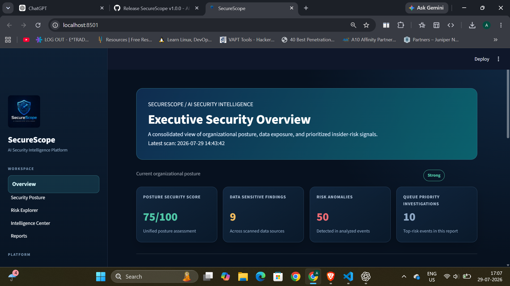
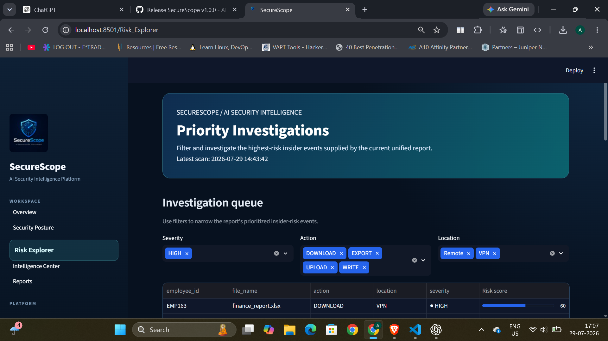
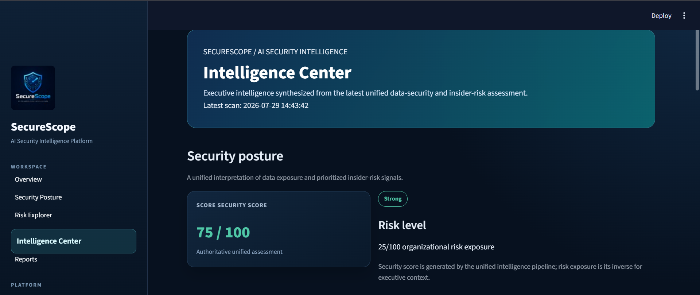
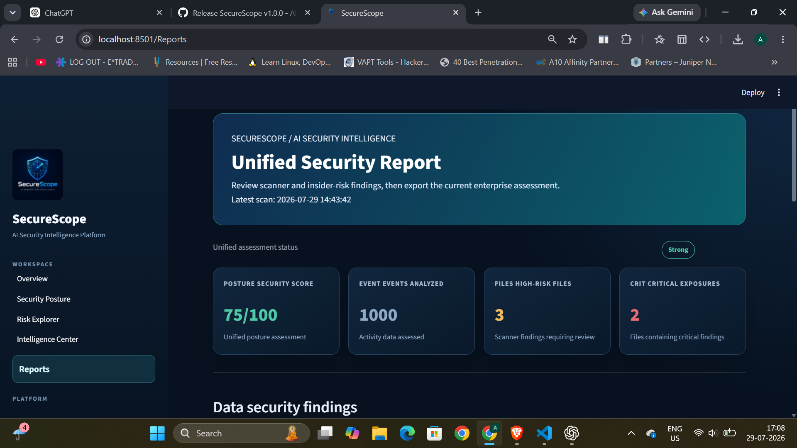

<p align="center">
  
</p>

<h1 align="center">
  SecureScope
</h1>

<p align="center">
  <b>AI-Powered DSPM & Insider Risk Detection Platform</b>
</p>

<p align="center">
  An AI-driven cybersecurity intelligence platform for sensitive data discovery,
  insider threat detection, risk analysis, and security visualization.
</p>


---

# 🔐 Overview

SecureScope is an AI-powered security intelligence platform that combines **Data Security Posture Management (DSPM)** concepts with **Machine Learning based Insider Risk Detection**.

The platform helps security teams:

- Discover sensitive data exposure
- Identify security risks
- Detect abnormal employee behaviour
- Calculate risk scores
- Investigate suspicious activities
- Generate security intelligence reports


SecureScope simulates a modern cybersecurity workflow by combining:

- Data discovery
- Sensitive information classification
- ML anomaly detection
- Risk scoring
- Security analytics dashboard


---

# 🚀 Features

## 🔍 Sensitive Data Discovery & Classification

SecureScope scans files and identifies sensitive information exposure.

### Capabilities

✅ File discovery and scanning  
✅ Sensitive data detection  
✅ Email detection  
✅ Phone number detection  
✅ Password exposure detection  
✅ High entropy secret detection  
✅ Risk scoring engine  
✅ Automated security reports  


### Detected Information Types

```
EMAIL
PHONE
PASSWORD_EXPOSURE
HIGH_ENTROPY_SECRET
```


---

# 🤖 AI Insider Risk Detection

SecureScope analyzes security activity logs and identifies abnormal behaviour using machine learning.

### Capabilities

✅ Synthetic security event generation  
✅ Feature engineering pipeline  
✅ Isolation Forest anomaly detection  
✅ Behavioural risk scoring  
✅ Risk event ranking  
✅ Security summary generation  
✅ CSV report generation  
✅ JSON report generation  
✅ Logging system  
✅ ML model persistence  


### Detected Risk Indicators

- After-hours activity
- VPN access
- Personal device usage
- Large file downloads
- Critical file access
- Unusual login behaviour
- Abnormal access patterns


---

# 📊 Security Intelligence Dashboard

SecureScope provides an interactive Streamlit dashboard for security investigation.

### Dashboard Features

✅ Executive security overview  
✅ Risk metrics visualization  
✅ Security posture analysis  
✅ Risk Explorer  
✅ Investigation workspace  
✅ Employee risk analysis  
✅ Severity filtering  
✅ Action filtering  
✅ Location filtering  
✅ Risk rationale display  
✅ Report exploration  


---

# 🏗️ Architecture


## Complete System Flow

```
                    SecureScope

                         |
        ------------------------------------
        |                                  |
        v                                  v

 Data Discovery Engine              Insider Risk Engine

        |                                  |

 File Scanner                      Security Logs

        |                                  |

 Sensitive Data Detection          Feature Engineering

        |                                  |

 Secret Detection                  Isolation Forest ML

        |                                  |

 Risk Scoring                      Anomaly Detection

        |                                  |

 Security Reports                  Risk Calculation

        ------------------------------------

                         |

                         v

              Unified Security Intelligence

                         |

                         v

              Streamlit Security Dashboard
```


---

# 🛠️ Tech Stack


## Programming Language

- Python


## Machine Learning

- Scikit-learn
- Isolation Forest
- Pandas
- NumPy


## Security Analysis

- Regex Pattern Matching
- Entropy Analysis
- Sensitive Data Classification
- Risk Scoring


## Dashboard

- Streamlit
- Custom CSS
- Interactive Data Tables


## Reporting

- JSON
- CSV


## Development

- Git
- GitHub
- Virtual Environment


---

# 📂 Project Structure


```
SecureScope/

│
├── scanner/
│   ├── File discovery
│   ├── Sensitive data detection
│   ├── Secret detection
│   └── Risk calculation
│
│
├── anomaly/
│   ├── main.py
│   ├── pipeline.py
│   ├── features.py
│   ├── detector.py
│   ├── risk.py
│   ├── summary.py
│   ├── ranking.py
│   ├── exporter.py
│   ├── logger.py
│   └── model_manager.py
│
│
├── dashboard/
│   ├── 0_Home.py
│   ├── pages/
│   ├── components.py
│   ├── theme.py
│   ├── styles.py
│   └── utils.py
│
│
├── sample_data/
│
├── assets/
│   └── logo.png
│
├── requirements.txt
│
├── README.md
│
└── .gitignore
```


---

# ⚙️ Installation


## Clone Repository

```bash
git clone https://github.com/aaryabrahme/SecureScope.git
```


Navigate into project:

```bash
cd SecureScope
```


Create virtual environment:

```bash
python -m venv .venv
```


Activate environment:

Windows:

```bash
.venv\Scripts\activate
```


Install dependencies:

```bash
pip install -r requirements.txt
```


---

# ▶️ Usage


## Run Insider Risk Detection Pipeline

```bash
python -m anomaly.main
```


The pipeline will:

1. Load security logs
2. Generate features
3. Detect anomalies
4. Calculate risk scores
5. Generate reports


---

## Run Dashboard

```bash
streamlit run dashboard/0_Home.py
```


---

# 📊 Sample Security Summary


Example output:

```
========== SecureScope Summary ==========


Total Events       : 1000

Normal Events      : 950

Anomalies Detected : 50

Average Risk Score : 14.74

Highest Risk Score : 100
```


---

# 🚨 Example High Risk Event


```
Employee ID : EMP036

Action      : DOWNLOAD

File        : payroll.xlsx

Sensitivity : CRITICAL

Status      : ANOMALY

Risk Score  : 100

Severity    : CRITICAL
```


Risk Factors:

```
- After-hours login
- Personal device usage
- Large file access
- ML anomaly detected
```


---

# 📁 Generated Reports


SecureScope automatically generates:


```
reports/

├── insider_risk_TIMESTAMP.csv

└── insider_risk_TIMESTAMP.json
```


Logs:


```
logs/

└── securescope.log
```


Saved ML models:


```
models/

└── isolation_forest.pkl
```


---

# 🔬 Machine Learning Approach


## Algorithm Used

### Isolation Forest


Isolation Forest is an unsupervised anomaly detection algorithm that identifies unusual behaviour by isolating abnormal observations.


The model analyzes:


- Login behaviour
- File access frequency
- Device information
- Location
- File sensitivity
- User actions


---

# 🧪 Model Performance


Example evaluation:


```
Accuracy  : 98%

Precision : 0.78

Recall    : 0.78

F1 Score  : 0.78
```


---

# 📸 Screenshots


## Security Dashboard




## Risk Explorer




## Security Intelligence




## Reports




---

## 🌐 Live Demo

Try SecureScope:

https://securescope.streamlit.app


---

# 🔮 Future Improvements


Potential enhancements:


- Real-time security monitoring
- SIEM integration
- Cloud deployment
- Authentication system
- Role-based access control
- Threat intelligence integration
- AI security assistant


---

# 🤝 Contribution


Contributions, suggestions, and improvements are welcome.


---

# 📜 License


MIT License


---

# 👨‍💻 Author


**Aarya Brahme**

AI & Data Science Engineering Student


GitHub:

https://github.com/aaryabrahme